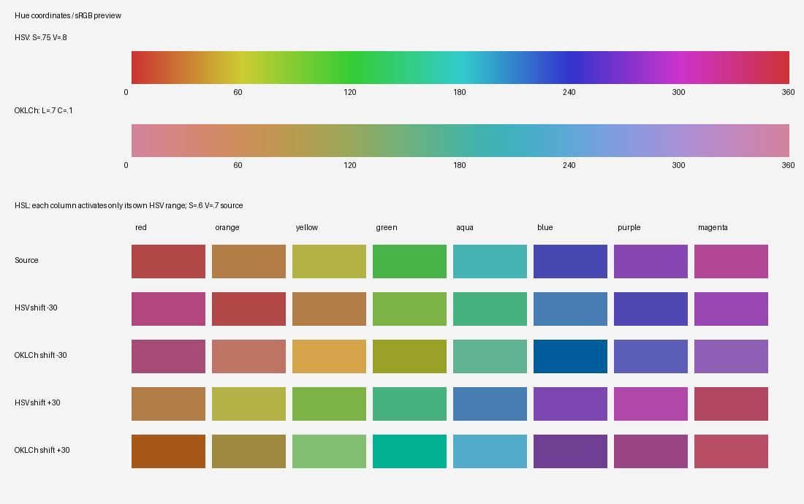

# Capability and Recipe Reference

Use the recipe contract and the sections for active controls. Omitted controls stay neutral. Numeric examples demonstrate syntax; derive the actual recipe from the photograph.

## Contents

- [Capability map](#capability-map)
- [Recipe contract](#recipe-contract)
- [Basic and tone controls](#basic-and-tone-controls)
- [Point curve](#point-curve)
- [RGB channel curves](#rgb-channel-curves)
- [Presence](#presence)
- [Color management](#color-management)
- [HSL](#hsl)
- [Hue coordinates and swatches](#hue-coordinates-and-swatches)
- [Color grading](#color-grading)
- [Local masks](#local-masks)
- [Detail and output](#detail-and-output)

## Capability map

Choose controls from the photograph's actual visual needs. Combining several families is valid when they serve one coherent intent; the presence of a control in this map is never a reason to activate it.

| Visual need | Primary tools | Use with care |
|---|---|---|
| Correct exposure or white balance | `basic.exposure`, `temperature`, `tint`, highlights/shadows/whites/blacks | Do not neutralize intentional color or infer white balance from global RGB averages alone |
| Build global tonal hierarchy | Basic tone controls and the main `curve` | Protect important subject structure; intentional localized clipping is allowed |
| Shape channel-specific blacks, midtones, or highlights | `channel_curves` | Endpoint moves can tint neutral blacks or whites |
| Recover atmospheric, mid-scale, or fine-scale separation | `presence.dehaze`, `clarity`, `texture` | These controls operate at different scales and are not substitutes for exposure, sharpening, or denoise |
| Separate or redirect existing colors | `hsl`, vibrance, saturation | Change only visibly relevant ranges and protect credible neutrals and skin |
| Build shadow/midtone/highlight palette separation | `color_grading` | Avoid a uniform global hue wash |
| Shape existing light or focal hierarchy locally | `local_corrections`, `local_adjustments`, geometric/luminance/color masks | Keep geometry consistent with source evidence; masks are not semantic selections |
| Control noise and output detail | `detail.denoise`, `sharpen`, threshold, edge protection | Keep off unless technically justified; inspect encoded detail at 100% |
| Improve perceptual color shaping or gamut behavior | `color_management.rendering`, `gamut_mapping` | Strict paths require managed tagged-sRGB conversion |
| Preserve output precision or reduce gradient banding | `output.png_bit_depth`, `png_dither` | 16-bit cannot restore missing source precision; dithering applies only to 8-bit PNG |

## Recipe contract

### Batch manifest

For a multi-output render, place every complete recipe in one manifest and call `grade-batch` once:

```json
{
  "schema_version": 1,
  "outputs": [
    {
      "output": "IMG_1234_A3_自然通透.jpg",
      "recipe": {
        "schema_version": 1,
        "style": {"id": "A", "name": "自然通透", "intensity": 3},
        "visual_intent": {
          "brightness_key": "明亮但保留高光层次",
          "contrast_structure": "稳定黑位与柔和中间调",
          "light_geometry": "顺应原图既有光向",
          "palette": "中性主色与克制暖色",
          "subject_separation": "用明度分离主体",
          "texture": "自然清晰"
        },
        "success_criteria": ["主体分离自然", "重要高光有纹理", "中性色无明显偏色"],
        "parameters": {"basic": {"exposure": 0.15}}
      }
    }
  ]
}
```

The manifest accepts exactly `schema_version` and `outputs`; version `1` requires `1–26` items. Every item accepts exactly a non-empty `output` path and one complete recipe following the contract below. Relative output paths resolve from the manifest directory. Output paths must be unique and must not resolve to the source. The CLI validates every manifest item before rendering begins, renders each result to a same-directory temporary path, and publishes final paths only after every encoded result passes verification. A failure removes temporary renders and preserves any pre-existing finals. Single-output `grade` also verifies a sibling temporary file before replacing its final path.

The structured fields record observable decisions, not private chain-of-thought. Use exactly the recipe, `style`, and `visual_intent` keys shown above. Set `schema_version` to `1`, use one uppercase letter for `style.id`, set intensity to `1`, `2`, or `3`, and provide three to five non-empty `success_criteria`. Accepted `parameters` sections are `basic`, `curve`, `channel_curves`, `presence`, `color_management`, `hsl`, `color_grading`, `local_corrections`, `local_adjustments`, `detail`, and `output`; omit inactive sections.

All numeric snippets in this reference exist only to demonstrate syntax or ordinary correction scale. Never reuse their hues, curve points, mask geometry, or magnitudes as a recipe seed. Derive active values independently from the current image and its source-relative visual intent.

Omitted defaults are:

- `0` for basic, HSL, and color-grading controls, except `color_grading.blending: 0.5`;
- `0` for `presence.dehaze`, `presence.clarity`, and `presence.texture`;
- `color_management.rendering: "legacy"` and `color_management.gamut_mapping: "clip"`;
- `[]` for the point curve, each RGB channel curve, and both local-mask arrays;
- `detail.denoise: 0`, `detail.sharpen: 0`, `detail.sharpen_radius: 1`, `detail.sharpen_threshold: 0`, and `detail.sharpen_edge_protection: 0`;
- `output.jpeg_quality: 95`, `output.png_compress: 6`, `output.png_bit_depth: 8`, and `output.png_dither: "none"`.

## Basic and tone controls

Accepted `basic` controls and ranges:

| Recipe control | Meaning | Validator accepts |
|---|---|---:|
| `temperature` | Warm (+) or cool (-) | `-1` to `+1` |
| `tint` | Magenta (+) or green (-) | `-1` to `+1` |
| `exposure` | Photographic exposure stops | `-4` to `+4` |
| `highlights` | Bright-region tone | `-1` to `+1` |
| `shadows` | Dark-region tone | `-1` to `+1` |
| `whites` | White point region | `-1` to `+1` |
| `blacks` | Black point region | `-1` to `+1` |
| `contrast` | Midpoint contrast | `-1` to `+1` |
| `vibrance` | Low-saturation-weighted color | `-1` to `+1` |
| `saturation` | Global saturation | `-1` to `+1` |

Values are normalized except exposure.

## Point curve

Use an empty array or at least two increasing `[x, y]` points from `x=0` to `x=1`; omit `curve` when inactive:

```json
"curve": [[0.0, 0.0], [0.25, 0.22], [0.5, 0.52], [0.75, 0.8], [1.0, 1.0]]
```

Keep x coordinates strictly increasing and all coordinates within `[0,1]`. Use a gentle S-curve or lifted/faded endpoints only when the selected look calls for it.

The main `curve` operates on encoded-sRGB luminance. The pipeline maps luminance through the piecewise-linear curve and scales RGB to the mapped luminance. It runs before any RGB channel curve.

## RGB channel curves

`channel_curves` is an optional object with only `red`, `green`, and `blue` keys. Each value uses the same empty-or-two-plus-point validation as the main curve. Omitted channels and empty arrays are fully neutral and are skipped without clipping their input:

```json
"channel_curves": {
  "red": [[0.0, 0.04], [0.5, 0.55], [1.0, 1.0]],
  "green": [],
  "blue": [[0.0, 0.08], [0.5, 0.5], [1.0, 0.94]]
}
```

Processing is deterministic and fixed:

1. Apply the main luminance `curve` first.
2. In encoded sRGB, independently map R, G, then B over the `[0,1]` domain.
3. Use piecewise-linear interpolation between control points.
4. For an active channel only, clip its input to `[0,1]` before interpolation. Endpoints at `x=0` and `x=1`, plus validated `y` coordinates in `[0,1]`, define the boundary output.

This order also applies inside each local adjustment: local main curve first, then local channel curves. A lifted channel endpoint introduces a channel-specific black tint; a lowered white endpoint reduces that channel in highlights. Prefer coordinated, restrained endpoint moves when neutral blacks or whites must remain neutral.

## Presence

`presence` is an optional object with only `dehaze`, `clarity`, and `texture`. Every included value must be a finite JSON number from `-1` to `+1`; booleans, non-finite values, unknown keys, and values outside the range are validation errors. Omitted controls expand to `0`, and an omitted or all-zero section is an exact processing skip.

```json
"presence": {
  "dehaze": 0.18,
  "clarity": 0.22,
  "texture": 0.12
}
```

| Control | Scale and effect | Guidance |
|---|---|---|
| `dehaze` | Low-frequency luminance-range recovery with black/highlight protection and restrained chroma recovery | Positive values expand low-frequency separation; negative values flatten it. |
| `clarity` | Mid-frequency, midtone-weighted local contrast | Positive values increase mid-scale contrast; negative values soften it. |
| `texture` | Small-scale detail gain with a spatial-coherence noise gate | Positive values enhance fine texture; negative values soften it. |

The fixed global order is `dehaze` → `clarity` → `texture`, after `local_corrections` and before vibrance, saturation, HSL, and color grading.

Use the three controls for distinct scales rather than stacking them by default. Dehaze is not a substitute for exposure or black-point work, clarity is not output sharpening, and texture is not denoise. Strong positive values may reveal existing noise or compression artifacts, so inspect smooth skies, skin, foliage, building edges, and backlit haze at full resolution.

## Color management

`color_management` is optional and accepts exactly two string fields:

```json
"color_management": {
  "rendering": "perceptual",
  "gamut_mapping": "oklch_compress"
}
```

| Field | Accepted values | Default | Behavior |
|---|---|---|---|
| `rendering` | `"legacy"`, `"perceptual"` | `"legacy"` | Selects the existing encoded-sRGB/HSV color algorithms or the fixed D65 sRGB/OKLab/OKLCh path. |
| `gamut_mapping` | `"clip"`, `"oklch_compress"` | `"clip"` | Selects hard RGB clipping or fixed soft-knee OKLCh chroma compression. |

The omitted/default pair is the compatibility path and does not change legacy pixels. `rendering: "perceptual"` changes only the global vibrance/saturation, HSL, and three-way color-grading stages:

- vibrance and saturation scale OKLCh chroma while keeping OKLab lightness and hue;
- the existing HSV hue ranges still determine HSL selection weights, but hue, chroma, and lightness changes are applied in OKLCh;
- the full validated HSL saturation range through `+1.5` is effective in this path;
- three-way grading adds color on the OKLab opponent axes and preserves OKLab lightness.

`oklch_compress` preserves in-range OKLCh lightness and hue while reducing excess chroma. Gamut mapping runs after global color shaping and again after creative local adjustments.

Perceptual rendering, OKLCh compression, and 16-bit PNG use strict tagged-sRGB handling and may block on invalid or unsupported profile conversion.

## HSL

Accepted HSL color keys are `red`, `orange`, `yellow`, `green`, `aqua`, `blue`, `purple`, and `magenta`. Each included color object may contain one hue-shift field, `saturation`, and `luminance`; omitted controls remain neutral. Use `hue_shift_oklch` with perceptual rendering or `hue_shift_hsv` with legacy rendering. Choose the range and sign from the source pixels and intended destination family.

The validator accepts each hue-shift field from `-90` to `+90` degrees, `saturation` from `-1` to `+1.5`, and `luminance` from `-1` to `+1`. For backward compatibility, the legacy HSL execution path clips the effective per-range saturation adjustment to `+1.0`; values from `+1.0` through `+1.5` remain accepted but produce the legacy `+1.0` effect. Change only visibly relevant ranges.

## Color grading

Accepted color-grading keys are `shadows`, `midtones`, `highlights`, `balance`, and `blending`. Each zone may contain one target-hue field and `saturation`; omitted zones or controls remain neutral. Use `target_hue_oklch` with perceptual rendering or `target_hue_hsv` with legacy rendering. Select every zone hue from the intended relationship among actual source regions.

Zone target hue runs from `0` to `360` degrees (`360` equals `0`) and zone `saturation` from `0` to `1`. `balance` runs from `-1` toward shadows to `+1` toward highlights. `blending` runs from `0` to `1`.

## Hue coordinates and swatches

All angles are degrees. Coordinate-specific fields are additive extensions of recipe schema `1`; the batch manifest also remains version `1`.

| Control | Pixel selection | Adjustment in `legacy` | Adjustment in `perceptual` |
|---|---|---|---|
| `hsl.<range>` | HSV hue on clipped stage-input sRGB; saturation gates near-neutral pixels | `hue_shift_hsv`: weighted HSV rotation | `hue_shift_oklch`: weighted OKLCh rotation |
| `color_grading.<zone>` | Encoded-sRGB luminance weights in legacy; OKLab lightness weights in perceptual | `target_hue_hsv`: HSV-derived tint direction | `target_hue_oklch`: OKLab a/b vector direction |
| Color mask `hue`, `width` | HSV hue and saturation on clipped input to the local item | Selection only | Selection only |

HSL range centers are always HSV: red `0`, orange `30`, yellow `60`, green `120`, aqua `180`, blue `240`, purple `275`, magenta `315`. The circular weighting has a default `32°` width, with overlapping neighboring ranges. Weights are measured once from the input to the HSL stage, after preceding tone/color controls, not necessarily from the original photograph. Each shift is multiplied by its range weight and saturation gate; contributions are summed and the final shift is clamped to ±90°. Positive values increase the angle in the **adjustment** coordinate, negative values decrease it. A shift of `30` is not a destination hue of `30`.

Three-way target hue specifies the direction of added color, not a replacement hue for every affected pixel. Perceptual grading adds an a/b vector to the existing OKLab color while retaining lightness; source color and zone strength determine the resulting hue. Zero zone saturation is neutral regardless of target hue.

For new recipes, write the explicit field for the selected rendering mode:

```json
"color_management": {"rendering": "perceptual", "gamut_mapping": "oklch_compress"},
"hsl": {"yellow": {"hue_shift_oklch": 20}},
"color_grading": {"shadows": {"target_hue_oklch": 250, "saturation": 0.15}}
```

Each HSL range or grading zone accepts exactly one hue field. Mode-mismatched fields and multiple hue fields are validation errors, including when one value is zero. The historical `hue` field is still accepted: it means HSV shift/target in legacy and OKLCh shift/target in perceptual. Its defaults and rendering meaning are unchanged. Expanded recipes retain the supplied hue field, so loading and saving explicit recipes retains coordinate validation. To rename an old field, copy its number to the corresponding explicit field **while retaining the rendering mode**. Changing rendering mode changes the color operation.

HSV-specific fields operate in legacy rendering; they do not provide HSV input conversion for perceptual rendering. To choose an OKLCh target from a concrete sRGB color, convert that color using `srgb_to_oklab` then `oklab_to_oklch` and read its hue. HSV hue alone does not specify the color for this conversion: saturation and value also matter, and neutral colors have no useful hue. A fixed angle offset cannot represent the relationship. Converting a target color does not convert a hue shift; shifts depend on each pixel's initial color and selection weight.



The upper bands compare identical numerical angles at HSV `S=.75, V=.8` and OKLCh `L=.7, C=.1`. They represent coordinate directions, not expected final grading colors. The lower rows show actual HSL output for ±30° shifts: each column starts at its named HSV range center with `S=.6, V=.7`, and activates only that range. Perceptual examples use OKLCh gamut compression; legacy examples use output clipping. Source saturation ensures the gate is fully active. Gamut mapping and source L/C affect visible results; the swatches illustrate coordinate semantics rather than prescribe a palette. Rebuild with `python scripts/hue_reference.py`.

For a numerical anchor, pure sRGB red, yellow, green, cyan, blue, and magenta have HSV angles `0, 60, 120, 180, 240, 300`, but approximately OKLCh angles `29.2, 109.8, 142.5, 194.8, 264.1, 328.4` respectively. These are conversions of those specific colors. Inspect the encoded photo after selecting or refining hue values; equal angle changes across coordinates do not imply equal visual changes.

## Local masks

Embed the same mask-item schema in one of two recipe arrays. Each array item contains exactly one `mask` object and one `adjustments` object:

- `local_corrections`: apply after global tone/curve and before vibrance, saturation, HSL, and color grading. Use for local exposure, white-balance, tonal, or corrective color work.
- `local_adjustments`: apply after HSL and color grading. Use for final creative dodge, burn, or color accents.

Place each mask in one stage according to its purpose. Every mask node requires `type`, `opacity` from `0` to `1`, and boolean `invert`; these fields have no implicit recipe defaults and must be present. Each node accepts exactly the fields listed for its type:

| Mask type | Required type-specific fields |
|---|---|
| `luminance` | `min` and `max` from `0` to `1`, with `max > min`; `feather` from `0.0001` to `1` |
| `color` | `hue` from `0` to `360`; `width` from `1` to `180`; `min_saturation` from `0` to `1` |
| `linear` | distinct `start: [x,y]` and `end: [x,y]`, with every coordinate from `0` to `1` |
| `radial` | `center: [x,y]` from `0` to `1`; `radius: [rx,ry]` from `0.0001` to `1`; `feather` from `0` to `0.99` |
| `composite` | `operation`: `"and"`, `"or"`, or `"subtract"`; `inputs`: an array of child mask nodes |

For `luminance`, `feather` is a half-width in normalized luminance: each threshold transitions across `threshold - feather` to `threshold + feather`, so the complete transition spans `2 * feather`. For `radial`, `feather` is a unitless fraction of the ellipse radius, not a fraction of the full image or a pixel distance. Its transition runs from normalized radial distance `1 - feather` to `1`; along the ellipse axes, that corresponds to `feather * rx` of image width and `feather * ry` of image height. A radial `feather` of `0` produces an exact hard edge.

For `linear`, let `t = dot(p - start, end - start) / ||end - start||²` for normalized pixel position `p`. Base coverage is `0` when `t <= 0`, `t²(3 - 2t)` when `0 < t < 1`, and `1` when `t >= 1`. Thus `start` is the zero-coverage end, `end` is the full-coverage end, values are clipped beyond both ends, and reversing the endpoints reverses the gradient. The node's `invert` and `opacity` apply afterward.

A composite mask combines already feathered mask coverage without semantic segmentation or a second feathering pass. Its deterministic operations are:

- `and`: pixel-wise `min` over `2–8` child masks.
- `or`: pixel-wise `max` over `2–8` child masks.
- `subtract`: exactly two child masks, evaluated as `clip(A - B, 0, 1)`; subtraction is directional, and additional subtraction requires explicit nesting.

Processing is post-order and fixed. Each leaf computes coverage from the same RGB snapshot for that local-adjustment item, then applies its own `invert` followed by `opacity`. A composite combines those completed child coverages, then applies the composite node's own `invert` followed by `opacity`. Sibling masks never observe one another's adjustments. Separate items in `local_corrections` or `local_adjustments` remain sequential, so a later item reads the result of the preceding item.

A mask tree may contain at most `6` node levels, counting its root as level `1`, and at most `32` leaf masks. The leaf limit applies independently to each local-adjustment item's root mask. Composite nodes do not accept `feather`; feathering remains an explicit property of eligible leaf nodes. Every node is checked for finite coverage in `[0,1]` after its own inversion and opacity.

For example, this mask selects bright pixels only where they also lie inside a feathered radial region:

```json
{
  "type": "composite",
  "operation": "and",
  "inputs": [
    {
      "type": "luminance",
      "min": 0.55,
      "max": 0.98,
      "feather": 0.12,
      "opacity": 1,
      "invert": false
    },
    {
      "type": "radial",
      "center": [0.55, 0.45],
      "radius": [0.35, 0.42],
      "feather": 0.5,
      "opacity": 1,
      "invert": false
    }
  ],
  "opacity": 0.8,
  "invert": false
}
```

To select a color range while excluding highlights, use `subtract` with the color mask as input `A` and the luminance mask as input `B`. Reversing the inputs produces a different mask.

`adjustments` contains one or more basic-control names from above, `curve`, `channel_curves`, `clarity`, or `texture`. Local `exposure` accepts `-4` to `+4`; other numeric adjustments accept `-1` to `+1`; local main and channel curves follow the curve rules above. Local `dehaze` is intentionally unsupported and is rejected as an unknown adjustment because its low-frequency estimate cannot be made mask-local without boundary mismatch.

Inside one local item, processing is fixed as local tone/curves → local clarity → local texture → local vibrance/saturation. The full-frame floating-point variant is calculated first and then blended with the completed mask. This keeps feathered coverage continuous and means mask coverage `0` returns the stage input exactly while coverage `1` returns the complete local variant.

```json
"local_adjustments": [
  {
    "mask": {
      "type": "radial",
      "center": [0.5, 0.45],
      "radius": [0.3, 0.4],
      "feather": 0.5,
      "opacity": 0.8,
      "invert": false
    },
    "adjustments": {
      "exposure": 0.2,
      "shadows": 0.1,
      "clarity": 0.12
    }
  }
]
```

Use masks to implement photographic light design rather than semantic editing. For bold work, combine only the masks the scene needs, such as a broad linear burn to deepen an edge, a radial dodge placed over the existing focal region, or a luminance mask to control brilliant highlights. Keep feathering broad enough to avoid visible transitions. Do not add light that contradicts the source direction.

Validation is recursive. Unknown or missing node fields, unsupported operations, invalid child counts, excessive depth or leaf count, non-finite numbers, and out-of-range values are errors. The `grade` CLI reports them on stderr with exit code `2` before creating an output file.

## Detail and output

Accepted `detail` and `output` controls and ranges:

| Recipe control | Meaning | Validator accepts | Guidance |
|---|---|---:|---|
| `detail.denoise` | Early blend with deterministic 3×3 median result | `0` to `1` | `0` off; use `0.05–0.25` cautiously |
| `detail.sharpen` | Unsharp amount | `0` to `2` | `0` off; use `0.10–0.40` cautiously |
| `detail.sharpen_radius` | Blur radius used by unsharp | `0.1` to `5` | Commonly `0.6–1.2` |
| `detail.sharpen_threshold` | Minimum encoded-sRGB luminance residual admitted to sharpening | `0` to `1` | `0` off; use roughly `0.003–0.02` to suppress low-amplitude noise |
| `detail.sharpen_edge_protection` | Strength of strong-luminance-edge suppression | `0` to `1` | `0` off; use `0.3–0.8` when steps or silhouettes develop rims |
| `output.jpeg_quality` | JPEG quality | integer `1` to `100` | Use `95` by default |
| `output.png_compress` | PNG compression level | integer `0` to `9` | Use `6` by default; lossless |
| `output.png_bit_depth` | PNG samples per RGB/alpha channel | integer `8` or `16` | Use `8` by default; `16` requires a PNG output path |
| `output.png_dither` | RGB quantization dither | `"none"` or `"tpdf"` | Use `"none"` by default; `"tpdf"` requires 8-bit PNG |

The script applies denoise before tonal amplification and sharpening after all grading. Keep both off unless technically justified or explicitly requested. Use `sharpen_threshold` to suppress low-amplitude residuals such as noise, and `sharpen_edge_protection` to reduce rims around strong edges.

Analysis, grading, and comparison decode 16-bit sRGB PNG sources at native precision, including when delivering 8-bit output. Non-sRGB 16-bit sources require external conversion to sRGB16. For 16-bit PNG output, the pipeline writes RGB16 or RGBA16 and preserves supported metadata; it cannot restore precision absent from the source. For 8-bit PNG, `png_dither: "tpdf"` adds deterministic zero-mean triangular noise before quantization and never touches alpha. Use it only for long smooth gradients that show or risk visible banding.
